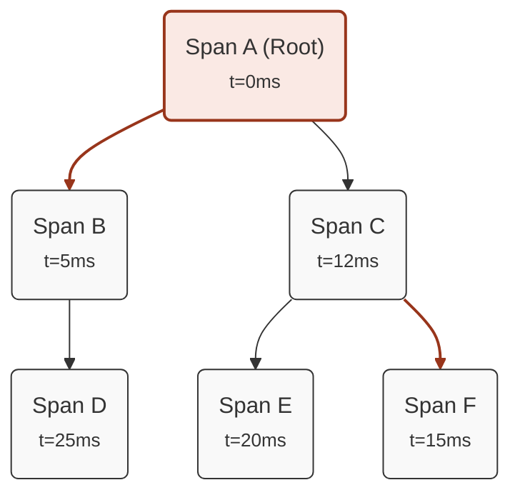
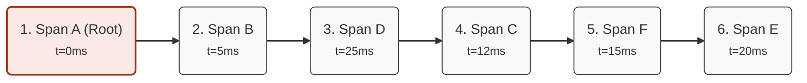

## Introduction
A *trace* is a collection of *spans*—in parent-child relationships—that represent the execution of a request or an operation within a distributed system. However, a *trace* is not necessarily a simple list of *spans*; since a *span* can have multiple children, a *trace* often takes the shape of a tree structure. Furthermore, it is not always possible to accurately predict the execution order of *spans* within a *trace*, for example, due to asynchronous calls or operations executed in parallel.

This creates the need to define multiple *sub-traces* to be verified within a main *trace*. For this reason, you can define multiple *expected traces* within a single test, each with its own set of *expected spans*.

Example:
```yaml
expectedTraces:
  - ordered: yes
    checker: contains
    spans:
      - serviceName: "grpc-server"
        operationName: "grpc.RollDice"
        spanKind: "server"
        spanStatus: "unset"
        maxDuration: 2s
        minDuration: 1us
      - serviceName: "nats-consumer"
        operationName: "nats-consume"
        spanKind: "consumer"
        spanStatus: "unset"
        maxDuration: 1s
      - serviceName: "dice-service"
        operationName: "dice-server"
        spanKind: "server"
        spanStatus: "unset"
      - serviceName: "even-or-odd-service"
        operationName: "even-or-odd-span"
        spanKind: "internal"
        spanStatus: "unset"
  - ordered: no
    spans:
      - serviceName: "dice-service"
        operationName: "dice-server"
        spanKind: "server"
        spanStatus: "unset"
      - serviceName: "nats-consumer"
        operationName: "nats-consume"
        spanKind: "consumer"
        spanStatus: "unset"
      - serviceName: "even-or-odd-service"
        operationName: "even-or-odd-span"
        spanKind: "internal"
        spanStatus: "unset"
```

## Configuration
Within an *expected trace*, you can define a set of *expected spans* representing the calls you expect to find in the collected *trace*, along with several parameters to modify the comparison logic.

The following are the parameters available within an *expected trace*:

| Argument | Description | Default | Optional |
| --------- | --------------------------------------------------------------------------------- | ----------------- | --------- |
| `ordered` | Indicates whether the order of the *expected spans* must be considered | true | Yes |
| `checker` | Strategy used to compare the *expected trace* with the collected trace | contains | Yes |

### Ordered
The `ordered` parameter indicates whether the order of the *expected spans* within the *expected trace* should be taken into account. If `ordered` is set to `true`, the *expected spans* must be present in the collected trace in the exact order they are defined in the file for the *expected trace* to be verified successfully.
If `ordered` is set to `false`, the *expected spans* can be found in the collected trace in any order.

### Checker
The `checker` parameter defines the strategy used to compare the *expected trace* against the collected trace. Possible values are:
- `contains`: the *expected trace* is successfully verified if all the *expected spans* are present in the collected trace, regardless of any additional *spans*.
- `strict`: the *expected trace* is successfully verified if all the *expected spans* are present in the collected trace and there are no extra *spans*.
- `startsWith`: the *expected trace* is successfully verified if all defined *expected spans* are present at the beginning of the collected trace. Additional *spans* are only allowed at the end of the collected trace.
- `endsWith`: the *expected trace* is successfully verified if all defined *expected spans* are present at the end of the collected trace. Additional *spans* are only allowed at the beginning of the collected trace.

## Trace Representation Method
As mentioned earlier, a *trace* is a set of parent-child *spans* that can be represented as a list of *spans* or as a tree structure.

Therefore, it is important to define how *expected spans* should be represented within an *expected trace* so they can be compared with the collected *spans*.

After collecting the *trace* from the backend, **Mtracer** performs the following steps:
- Represents the collected *spans* as a directed graph, where each node is a *span* and each edge represents a parent-child relationship between two *spans*.
- Sorts children based on their *span* start timestamp in ascending order.
- Performs a Depth-First Search (DFS) on the graph and represents the *spans* as an ordered list based on the visit order of the nodes during the traversal.

This representation makes it possible to flatten entire branches of *spans* into an ordered list, where the traversal order is based on the start timestamp of the *spans*. Furthermore, it allows any type of *trace* to be represented as a list of *spans*.

Example conversion from a *trace* represented as a directed graph to an ordered list:

### Directed Graph Representation


### Ordered List Representation

