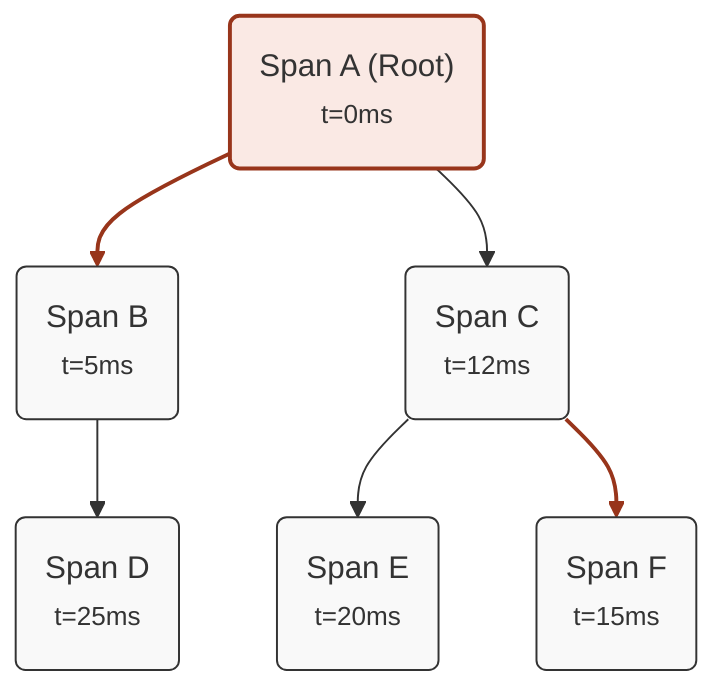
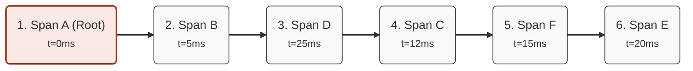

## Introduction
A *trace* is a collection of spans, where one is the child of another, representing the execution of a request or an operation within a distributed system. However, a trace is not necessarily a simple list of spans, as a span can have multiple children, giving the trace a tree-like structure. Moreover, it is not always possible to predict the execution order of spans within a trace, for instance in the presence of asynchronous calls or parallel operations.  

This creates the need to define multiple *sub-traces* to verify within the main trace. Therefore, it is possible to define multiple *expected traces* within a test, each with its own set of *expected spans*.

Example:
```yaml
expectedTraces:
  - ordered: yes
    checker: contains
    spans:
      - serviceName: "grpc-server"
        operationName: "grpc.RollDice"
        spanKind: "server"
        spanStatus: "unset"
        maxDuration: 2s
        minDuration: 1us
      - serviceName: "nats-consumer"
        operationName: "nats-consume"
        spanKind: "consumer"
        spanStatus: "unset"
        maxDuration: 1s
      - serviceName: "dice-service"
        operationName: "dice-server"
        spanKind: "server"
        spanStatus: "unset"
      - serviceName: "even-or-odd-service"
        operationName: "even-or-odd-span"
        spanKind: "internal"
        spanStatus: "unset"
  - ordered: no
    spans:
      - serviceName: "dice-service"
        operationName: "dice-server"
        spanKind: "server"
        spanStatus: "unset"
      - serviceName: "nats-consumer"
        operationName: "nats-consume"
        spanKind: "consumer"
        spanStatus: "unset"
      - serviceName: "even-or-odd-service"
        operationName: "even-or-odd-span"
        spanKind: "internal"
        spanStatus: "unset"
```

## Configuration
Within an *expected trace*, you can define a set of *expected spans* that represent the calls you expect to find within the collected trace, along with various parameters to modify the comparison mode.

The parameters available within an *expected trace* are defined below:

| Argument  | Description                                                                       | Default value | Optional  |
| --------- | --------------------------------------------------------------------------------- | ------------- | --------- |
| `ordered` | Indicates whether the order of the *expected spans* should be considered          | true          | Yes       |
| `checker` | The mode used to compare the *expected trace* against the collected trace         | contains      | Yes       |

### Ordered
The `ordered` parameter indicates whether the order of the *expected spans* within the *expected trace* should be taken into account. If `ordered` is set to `true`, the *expected spans* must be present in the collected trace in the same order as they are defined in the file for the *expected trace* to be verified.    
If `ordered` is set to `false`, the *expected spans* can appear in the collected trace in any order.

### Checker
The `checker` parameter specifies the mode used to compare the *expected trace* against the collected trace. The possible values are:
- `contains`: the *expected trace* is verified if all *expected spans* are present in the collected trace, regardless of any additional spans
- `strict`: the *expected trace* is verified if all *expected spans* are present in the collected trace and there are no additional spans
- `startsWith`: the *expected trace* is verified if all the defined *expected spans* are present at the beginning of the collected trace. Additional spans are only allowed at the end of the trace
- `endsWith`: the *expected trace* is verified if all the defined *expected spans* are present at the end of the collected trace. Additional spans are only allowed at the beginning of the trace

## Trace representation method
As mentioned earlier, a trace is a collection of child-parent spans that can be represented as a list of spans or as a tree structure.

Therefore, it must be clear how the *expected spans* should be represented within an *expected trace* so that they can be compared with the collected spans. 

After collecting the trace from the backend, **Mtrace** performs the following steps:
- it represents the collected spans as a directed graph, where each node represents a span and each edge represents the parent-child relationship between two spans
- it sorts the children in ascending order based on the spans' timestamp
- it explores the graph using depth-first search (DFS) and represents the spans as an ordered list based on the node visitation order during the DFS traversal

This approach allows entire branches of spans to be represented as an ordered list, where the exploration order is based on the start timestamp of the spans. Furthermore, it makes it possible to represent any kind of trace as a list of spans.

Example of conversion from a trace represented as a directed graph to a trace represented as an ordered list:

### Representation as a directed graph


### Representation as an ordered list

