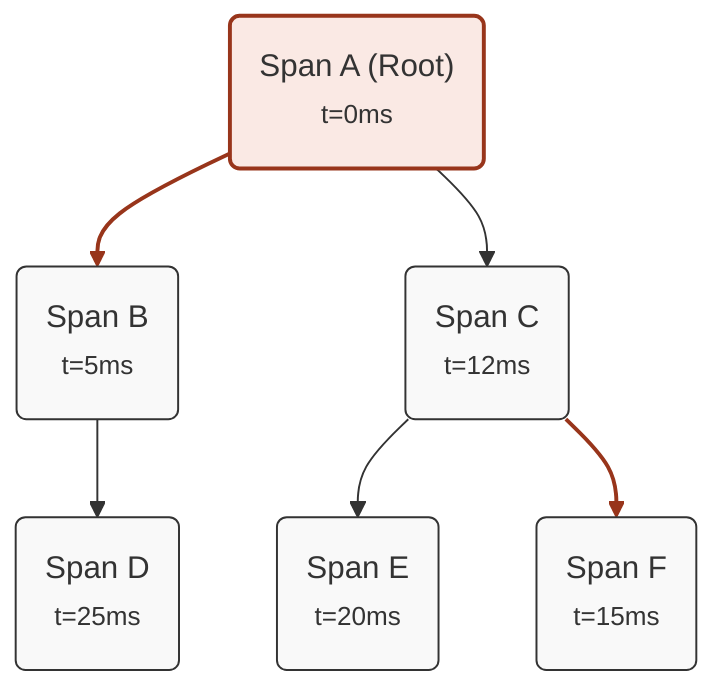
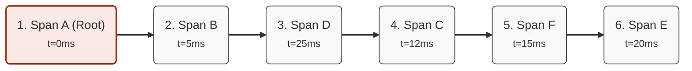

## Introduzione
Una *trace* è un insieme di *span*, l'una figlia dell'altra, che rappresentano l'esecuzione di una richiesta o di un'operazione all'interno di un sistema distribuito. Tuttavia, una *trace* non è necessariamente una semplice lista di *span*; poiché una *span* può avere più figli, la *trace* può assumere una struttura ad albero. Inoltre, non sempre è possibile prevedere con certezza l'ordine di esecuzione delle *span* all'interno di una *trace*, ad esempio in presenza di chiamate asincrone o di operazioni eseguite in parallelo.  

Tutto ciò crea la necessità di definire molteplici *sub-trace* da verificare all'interno di una *trace* principale. Per questo motivo, in un test è possibile definire più *expected trace*, ognuna con il proprio insieme di *expected span*.

Esempio:
```yaml
expectedTraces:
  - ordered: yes
    checker: contains
    spans:
      - serviceName: "grpc-server"
        operationName: "grpc.RollDice"
        spanKind: "server"
        spanStatus: "unset"
        maxDuration: 2s
        minDuration: 1us
      - serviceName: "nats-consumer"
        operationName: "nats-consume"
        spanKind: "consumer"
        spanStatus: "unset"
        maxDuration: 1s
      - serviceName: "dice-service"
        operationName: "dice-server"
        spanKind: "server"
        spanStatus: "unset"
      - serviceName: "even-or-odd-service"
        operationName: "even-or-odd-span"
        spanKind: "internal"
        spanStatus: "unset"
  - ordered: no
    spans:
      - serviceName: "dice-service"
        operationName: "dice-server"
        spanKind: "server"
        spanStatus: "unset"
      - serviceName: "nats-consumer"
        operationName: "nats-consume"
        spanKind: "consumer"
        spanStatus: "unset"
      - serviceName: "even-or-odd-service"
        operationName: "even-or-odd-span"
        spanKind: "internal"
        spanStatus: "unset"
```

## Configurazione
In una *expected trace* è possibile definire un insieme di *expected span*, che rappresentano le chiamate previste all'interno della *trace* raccolta, insieme a vari parametri per personalizzare la modalità di confronto.

Di seguito sono definiti i parametri utilizzabili all'interno di un *expected trace*:

| Argomento | Descrizione                                                                       | Valore di default | Opzionale |
| --------- | --------------------------------------------------------------------------------- | ----------------- | --------- |
| `ordered` | Indica se deve essere considerato l'ordine delle *expected span*                  | true              | Si        |
| `checker` | Modalità con cui viene paragonata l'*expected trace* rispetto alla trace raccolta | contains          | Si        |

### Ordered
Il parametro `ordered` indica se deve essere considerato l'ordine delle *expected span* all'interno dell'*expected trace*. Se `ordered` è impostato a `true`, affinché l'*expected trace* sia verificata, le *expected span* devono essere presenti nella trace raccolta nello stesso ordine in cui sono definite.    
Se invece `ordered` è impostato a `false`, le *expected span* possono essere presenti nella trace raccolta in qualsiasi ordine.

### Checker
Il parametro `checker` indica la modalità con cui l'*expected trace* viene confrontata con la trace raccolta. I valori possibili sono:
- `contains`: l'*expected trace* è verificata se tutte le *expected span* sono presenti nella trace raccolta, indipendentemente dalla presenza di eventuali *span* aggiuntive
- `strict`: l'*expected trace* è verificata se tutte le *expected span* sono presenti nella trace raccolta e non sono presenti *span* aggiuntive
- `startsWith`: l'*expected trace* è verificata se tutte le *expected span* definite sono presenti all'inizio della trace raccolta. Sono ammesse *span* aggiuntive solo alla fine della trace raccolta 
- `endsWith`: l'*expected trace* è verificata se tutte le *expected span* definite sono presenti alla fine della trace raccolta. Sono ammesse *span* aggiuntive solo all'inizio della trace raccolta

## Metodo di rappresentazione della trace
Come già accennato, una *trace* è un insieme di *span* genitore-figlio che può essere rappresentato come una lista di *span* o come una struttura ad albero.

Per questo motivo, è importante definire come le *expected span* debbano essere rappresentate all'interno di una *expected trace* per poter essere confrontate con le *span* raccolte. 

Dopo aver raccolto la *trace* dal backend, **Mtracer** esegue questi passaggi:
- Rappresenta le *span* raccolte come un grafo orientato, dove ogni nodo è una *span* e ogni arco rappresenta la relazione padre-figlio tra due *span*.
- Ordina i figli in base al timestamp di inizio delle *span* in ordine crescente.
- Esplora il grafo in profondità (DFS) e rappresenta le *span* come una lista ordinata in base all'ordine di visita dei nodi.

Questa rappresentazione permette di trasformare interi rami di *span* in una lista ordinata, in cui l'ordine di esplorazione si basa sul timestamp di inizio delle *span*. Inoltre, consente di rappresentare qualsiasi tipo di *trace* come una lista di *span*.

Esempio di conversione da *trace* rappresentata come grafo orientato a *trace* rappresentata come lista ordinata:

### Rappresentazione come grafo orientato


### Rappresentazione come lista ordinata
